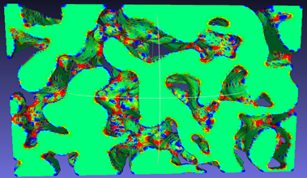
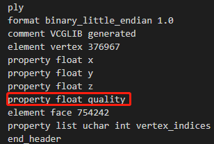

# 3D曲率ply文件读取代码

# 运行结果

# 总结文章

[总结文章](https://zhuanlan.zhihu.com/p/112294045)

# 参考资料

ply文件读取库[rply](https://web.archive.org/web/20081203195143/http://www.cs.princeton.edu/~diego/professional/rply/)

# 需要

带有曲率的ply文件。曲率计算可由MeshLab完成，点击导出，可导出曲率到ply。

本人测试ply文件以及运行后的结果在此处可下载：[百度云：j7f1](https://pan.baidu.com/s/1dlKg2XSfuDIyifxkXDH9kA)

ply文件查看方式：使用vscode打开后缀为.ply的文件，查看其中是否存在属性。`property float quality`
 

# 运行

运行main.cpp即可，需要修改为自己的文件路径。对应的，可能需要自己修改源代码。