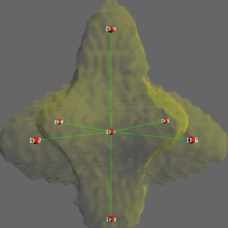

# 3D骨架提取代码

个人各种算法代码仓库。

作者：憨豆酒（YinDou），yindou97@163.com，熟悉图形学，图像处理领域，经常更新的学习总结仓库：<https://github.com/douysu/person-summary> 如果对您有帮助还请帮忙点一个star，如果大家发现错误以及不合理之处，还希望多多指出。

- [我的Github](https://github.com/douysu)
- [我的博客](https://blog.csdn.net/ModestBean)
- [我的知乎](https://zhuanlan.zhihu.com/c_1218472587279433728)

# 运行结果

# 代码

## 1 ImagePy读取图像栈

链接：[知乎介绍的使用方式](https://zhuanlan.zhihu.com/p/31387917)

## 2 matlab 骨架提取代码

链接: [MatLab](https://ww2.mathworks.cn/matlabcentral/fileexchange/43400-skeleton3d)

## 3 scikit-image Python代码

链接：[Skeletonize](https://scikit-image.org/docs/dev/auto_examples/edges/plot_skeleton.html#sphx-glr-auto-examples-edges-plot-skeleton-py)

以上方法都是基于1994年的算法：Building Skeleton Models via 3-D Medial Surface/Axis Thinning Algorithms有兴趣的可以看一下这个Paper。

# 常见问题列表

1、您好，我想问一下您这个算法的matlab程序，当输入数据为ply和obj时，需要用Meshlab做什么处理？还有我如果想使用输出文件，输出的格式是什么，该如何使用它呢？谢谢您！

回答：当输入数据是ply和obj时需要进行体素化处理。想输出文件可以输出成图像栈或者.mat文件。 本人没有提供基于obj和ply的mesh格式的代码，这篇Paper实现了，可以参考Building Skeleton Models via 3-D Medial Surface/Axis Thinning Algorithms。

2、现在实现的效率如何，可以来份源码参考一下吗？

回答：实现的效率一般，当数据量比较大时，计算速度可能会慢。

3、看到您写的博客，3D模型骨架提取及分析，因初次接触这一方面，冒昧打扰一下是否可以分享相关源码或者相关资料亦可？

回答：资料链接我已经总结给出了，先看看在联系我。