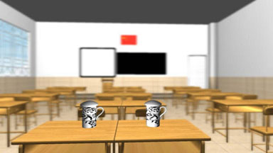
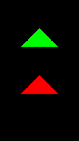
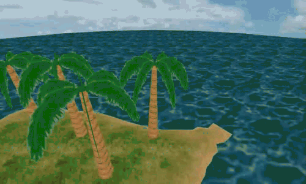
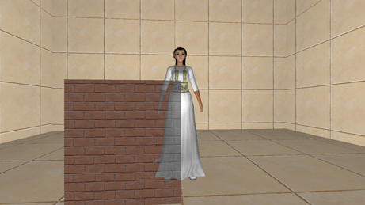

# 3D代码实现仓库

存放3D代码实现，我的联系方式是yindou97@163.com，如果对您有帮助还请帮忙点一个star。我的个人总结仓库：<https://github.com/douysu/person-summary>

- [我的知乎](https://zhuanlan.zhihu.com/c_1218472587279433728)
- [我的Github](https://github.com/douysu)
- [我的博客](https://blog.csdn.net/ModestBean)

# 目录

内容 | 源代码位置 | 效果 |
-|-|-|
OpenGL 拖尾、刀光、剑光、尾焰效果的开发| [源代码位置](./streak) | 

 |
虚化模糊场景（类似摄像机的人像效果）| [源代码位置](./blur-scene-gaussian--3d) |  |
OpenGL ES Uniform缓冲| [源代码位置](./opengles-uniform-buffer) |  

 |  |
3D摄像机漫游| [源代码位置](./CameraRoam) |   |
3D-PLY文件读取曲率计算| [源代码位置](./3D-PLY) |  |
3D-骨架提取| [源代码位置](./3D-skeleton) | 

 |
人物透视X光效果| [源代码位置](./x-ray-scene_3d) |  |