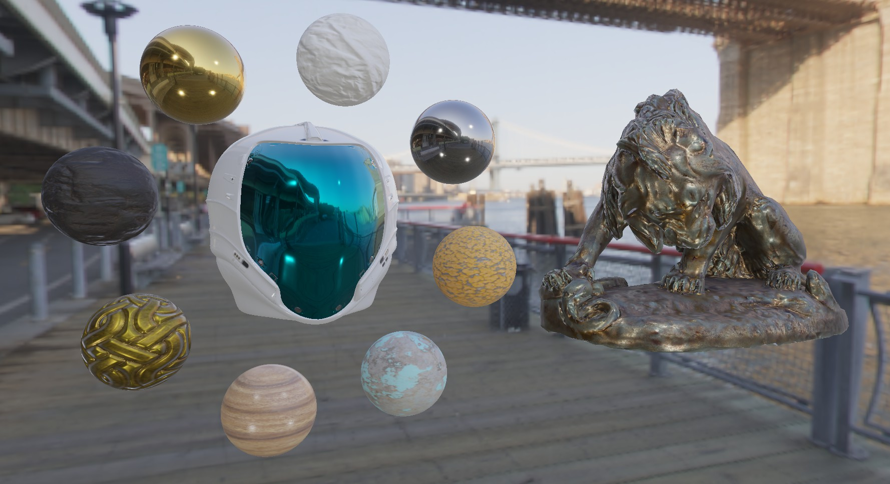
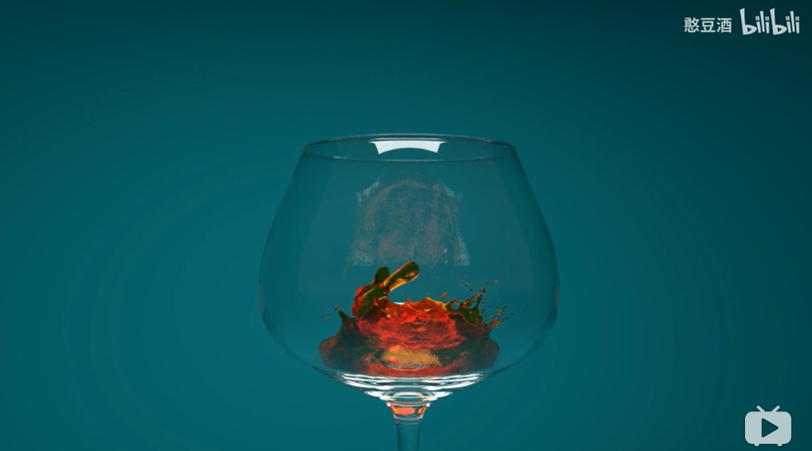
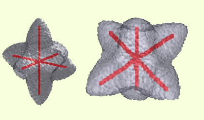

# 3D代码实现仓库

图形学项目案例实现总结（包括渲染、光照、点云等）。我的联系方式是yindou97@163.com，如果对您有帮助还请帮忙点一个star。记录图形学开发内容，学习过程中的总结仓库：<https://github.com/douysu/computer-graphics-notes>

- [知乎专栏](https://zhuanlan.zhihu.com/graphics-douysu)
- [博客地址](https://blog.csdn.net/ModestBean)

# 下载单一项目代码

Chrome安装 ``GitZip for github``插件，双击单一目录即下载。(每个项目一个rep太难整理了~~)

# 目录

内容 | 介绍 | 
:-:|:-|
 | Physically Based Rendering-IBL（PBR基于物理渲染） [[Video](https://www.bilibili.com/video/BV1TV411z7qe)] [[WebPage](https://zhuanlan.zhihu.com/p/176474625)] [[Code](https://github.com/douysu/graphics-algorithm/tree/master/physically-rendering)]
 | Fluid Simulation(物理动画流体模拟)   [[Video](https://www.bilibili.com/video/BV1454y127Vy?from=search&seid=5825690446384116530)] [[WebPage](https://zhuanlan.zhihu.com/p/161808444)] [[Code](https://github.com/douysu/graphics-algorithm/tree/master/melt-animation)]
 | Ray Tracing（光线追踪)   [[WebPage](https://zhuanlan.zhihu.com/p/144189898)]  [[Code](https://github.com/douysu/graphics-algorithm/tree/master/tinyraytracerYD)]
 | Software Rendering（软渲染）   [[WebPage](https://zhuanlan.zhihu.com/p/128112217)]  [[Code](https://github.com/douysu/graphics-algorithm/tree/master/tinyrendererYD)]
 | 3D Curvature（3D曲率原理及计算）   [[WebPage](https://zhuanlan.zhihu.com/p/112294045)]  [[Code](https://github.com/douysu/graphics-algorithm/tree/master/3D-PLY)]
 | 3D Skeleton Analysis（3D模型骨架提取及分析）   [[WebPage](https://zhuanlan.zhihu.com/p/112299945)]  [[Code](https://github.com/douysu/graphics-algorithm/tree/master/3D-skeleton)]
 | 3D Medical Body（医疗项目3D人体展示系统）   [[WebPage](https://blog.csdn.net/ModestBean/article/details/79241519)]  [[Code](https://github.com/douysu/graphics-algorithm/tree/master/moving-light-strip)]
 | OpenGL MotionStreak（OpenGL拖尾、刀光、剑光、尾焰效果）   [[WebPage](https://zhuanlan.zhihu.com/p/112252151)]  [[Code](https://github.com/douysu/graphics-algorithm/tree/master/streak)]
 | 3D Aquarium（基于物理粒子系统的鱼群水族馆）    [[Code](https://github.com/douysu/graphics-algorithm/tree/master/wallpaper)]
 | 3D Scene Blur（OpenGL场景Blur虚化景深效果）   [[WebPage](https://blog.csdn.net/ModestBean/article/details/79512208)]  [[Code](https://github.com/douysu/graphics-algorithm/tree/master/blur-scene-gaussian--3d)]
 | Multi-buffer X-Ray（多缓冲X-Ray人物透视效果）   [[Code](https://github.com/douysu/graphics-algorithm/tree/master/x-ray-scene_3d)]
 | OpenGL Camera（OpenGL 摄像机漫游）   [[WebPage](https://blog.csdn.net/ModestBean/article/details/79130876)]  [[Code](https://github.com/douysu/graphics-algorithm/tree/master/CameraRoam)]
 | OpenGL Uniform Buffer Object（Uniform缓冲对象）   [[WebPage](https://blog.csdn.net/ModestBean/article/details/79130517)]  [[Code](https://github.com/douysu/graphics-algorithm/tree/master/opengles-uniform-buffer)]

