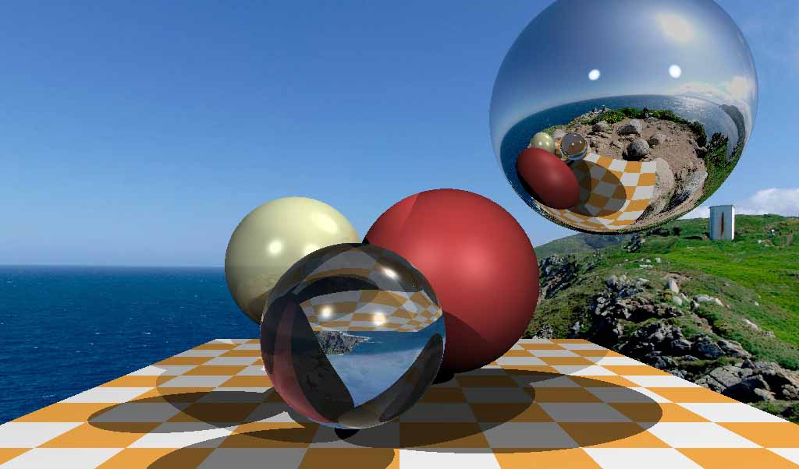
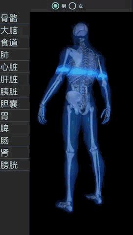

# 3D代码实现仓库

图形学项目案例实现总结（包括渲染、光照、点云等）。我的联系方式是yindou97@163.com，如果对您有帮助还请帮忙点一个star。我的个人总结仓库：<https://github.com/douysu/person-summary>

- [我的知乎专栏](https://zhuanlan.zhihu.com/graphics-douysu)
- [我的Github](https://github.com/douysu)
- [我的博客](https://blog.csdn.net/ModestBean)

# 下载单一项目代码

Chrome安装 ``GitZip for github``插件，双击单一目录即下载。

# 目录

内容 | 源代码位置 | 效果 |
:-:|:-:|:-:|
Physically Based Rendering（PBR基于物理渲染） | [源代码位置](./physically-rendering) |  [[演示视频]](https://www.bilibili.com/video/BV1TV411z7qe) |
Ray Tracing（光线追踪） | [源代码位置](./tinyraytracerYD) | 

 |
Software Rendering（软渲染） | [源代码位置](./tinyrendererYD) | 

 |
Fluid Simulation(物理动画流体模拟) | [源代码位置](./melt-animation) | 

 |
3D Curvature（3D曲率原理及计算）| [源代码位置](./3D-PLY) | 

 |
3D Skeleton Analysis（3D模型骨架提取及分析）| [源代码位置](./3D-skeleton) | 

 |
3D Medical Body（医疗项目3D人体展示系统） | [源代码位置](./moving-light-strip) | 

 |
OpenGL MotionStreak（OpenGL拖尾、刀光、剑光、尾焰效果）| [源代码位置](./streak) | 

 |
3D Aquarium（基于物理粒子系统的鱼群水族馆） | [源代码位置](./wallpaper) | 

 |
3D Scene Blur（OpenGL场景Blur虚化景深效果）| [源代码位置](./blur-scene-gaussian--3d) |  |
Multi-buffer X-Ray（多缓冲X-Ray人物透视效果）| [源代码位置](./x-ray-scene_3d) |  |
OpenGL Uniform Buffer Object（Uniform缓冲对象）| [源代码位置](./opengles-uniform-buffer) |  

 |  |
OpenGL Camera（OpenGL 摄像机漫游）| [源代码位置](./CameraRoam) |   |
