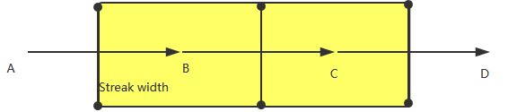

## MyStreak
This is a Trailing Sample,it is similar to the fruit knife cut light effect ,weapon waving effect,airplane tail flame.
When the Fingers move on the screen ,the streak is appear.
## Running Result

## Algorithm 

The yellow section is the streak.	A,B,C,D are the screen points ,by these points ,you can calculate the streak points.

I use a list to store these points ,the length of list is fixed length . one point have a parameter--lifecycle.
