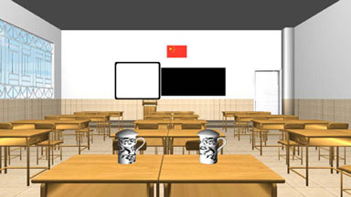

# 虚化模糊场景（类似摄像机的人像效果）

# 介绍

最近研究了一个基于高斯函数的模糊效果的Demo，主要是为了完成场景的虚化效果，也就是距离摄像机较近的地方比较清楚，距离较远的地方比较模糊。效果如下：

# 算法介绍

[算法介绍](https://blog.csdn.net/ModestBean/article/details/79512208)

# 需要

- Android Studio全家桶
- OpenGL ES 3.0 
- Java

# 运行

git clone，打开Android Studio import project。 点击run。
