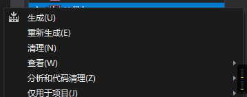
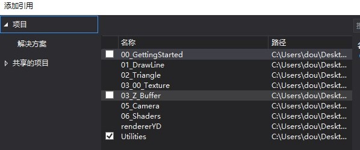

# 小型光栅渲染器

非常感谢和推荐Sokolov的教程，Sokolov使用500行C++代码实现一个光栅渲染器。教程学习过程非常平滑，从画点、线和三角形开始教学，在逐步深入三维变换，投影，再到顶点着色器，片段着色器等等。教程地址：<https://github.com/ssloy/tinyrenderer>。Sokolov的教程为英文，我翻译了其文章。翻译文章这里可以找到：[点击链接](https://zhuanlan.zhihu.com/p/128112217)

作者：憨豆酒（YinDou），yindou97@163.com，熟悉图形学，图像处理领域，经常更新的学习总结仓库：<https://github.com/douysu/person-summary> 如果对您有帮助还请帮忙点一个star，如果大家发现错误以及不合理之处，还希望多多指出。

- [我的知乎](https://zhuanlan.zhihu.com/c_1218472587279433728)
- [我的Github](https://github.com/douysu)
- [我的博客](https://blog.csdn.net/ModestBean)

# 实现效果

教程最终实现的渲染效果如下图所示：

# 相应文章目录：

[[从零构建光栅渲染器] 0.引言](https://zhuanlan.zhihu.com/p/128112217)

[[从零构建光栅渲染器] 1.Bresenham 画线算法](https://zhuanlan.zhihu.com/p/128927381)

[[从零构建光栅渲染器] 2.三角形栅格化和背面剪裁](https://zhuanlan.zhihu.com/p/132698610)

[[从零构建光栅渲染器] 3.隐藏面剃除 z-buffer（深度缓冲）](https://zhuanlan.zhihu.com/p/133696671)

[[从零构建光栅渲染器] 4.透视投影](https://zhuanlan.zhihu.com/p/138500969)

[[从零构建光栅渲染器] 5.移动摄像机](https://zhuanlan.zhihu.com/p/140946151)

[[从零构建光栅渲染器] 6. 顶点和片元着色器的工作原理](https://zhuanlan.zhihu.com/p/141201484)

# 需要

注意：Sokolov在Linux编写的代码，本仓库在Windows，Sokolov的源代码在这里<https://github.com/ssloy/tinyrenderer>

本代码已经经过测试，所需要的环境：

- Visual Studio 2019（其他版本VS未经过测试）

# 运行

我将重复代码都放到了Utilities中，方便管理。所以您需要设置如下步骤才可运行：

1、将项目Utilities设置成静态链接库。如图所示:

2、右键项目Utilities点击生成lib。

3、为需要运行的项目添加引用。

4、设置需要启动的项目。run，即可生成output.tga。
