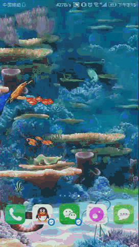
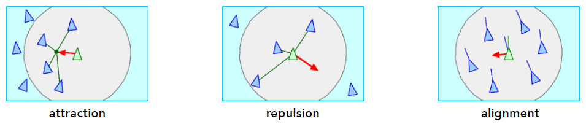
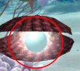

# 基于物理粒子系统的鱼群水族馆

作者：憨豆酒（YinDou），yindou97@163.com，熟悉图形学，图像处理领域，经常更新的学习总结仓库：<https://github.com/douysu/person-summary> 如果对您有帮助还请帮忙点一个star，如果大家发现错误以及不合理之处，还希望多多指出。

- [我的Github](https://github.com/douysu)
- [我的博客](https://blog.csdn.net/ModestBean)
- [我的知乎](https://zhuanlan.zhihu.com/c_1218472587279433728)

# 介绍

运行效果：

主要有以下内容：

1、基于物理粒子系统的鱼群算法。个体的鱼如何听从集体？
- 任何一支鱼不可以落单，其他鱼对此鱼存在引力。
- 鱼与鱼之间不能距离太近，之间存在斥力。
- 鱼的朝向。考虑鱼群的方向，初始速度，根据力计算的加速度等。

2、基于粒子系统的珍珠辉光效果。

每条鱼相当于一个粒子，粒子之间存在

# 需要

- Android（目前高版本的可能不支持个人开发的动态壁纸）
- OpenGL ES 3.0

# 运行

打开Android Studio->import project->run。运行成功后可在壁纸设置界面查看。