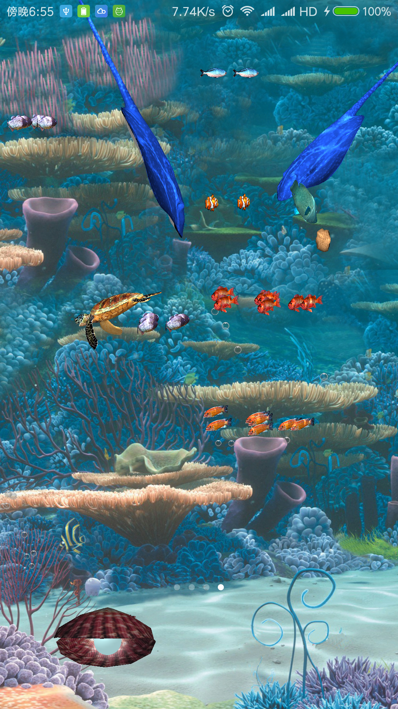

# 介绍

运行效果：

主要有以下内容：

1、基于物理粒子系统的鱼群算法。个体的鱼如何听从集体？
- 任何一支鱼不可以落单，其他鱼对此鱼存在引力。
- 鱼与鱼之间不能距离太近，之间存在斥力。
- 鱼的朝向。考虑鱼群的方向，初始速度，根据力计算的加速度等。

2、基于粒子系统的珍珠辉光效果。

每条鱼相当于一个粒子，粒子之间存在

# 需要

- Android（目前高版本的可能不支持个人开发的动态壁纸）
- OpenGL ES 3.0

# 运行

打开Android Studio->import project->run。运行成功后可在壁纸设置界面查看。