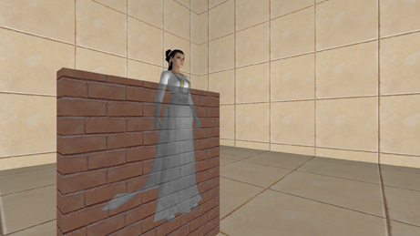
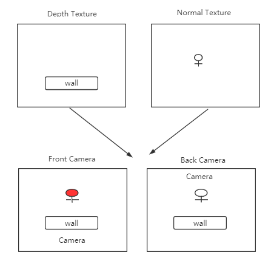

# 人物透视X光
作者：憨豆酒（YinDou），yindou97@163.com，熟悉图形学，图像处理领域，经常更新的学习总结仓库：<https://github.com/douysu/person-summary> 如果对您有帮助还请帮忙点一个star，如果大家发现错误以及不合理之处，还希望多多指出。

- [我的Github](https://github.com/douysu)
- [我的博客](https://blog.csdn.net/ModestBean)
- [我的知乎](https://zhuanlan.zhihu.com/c_1218472587279433728)

# 介绍

效果常常应用于游戏中的额遮挡，例如人物出现在建筑后方，依然可以渲染。效果可以看图所示。墙壁可以半遮挡人物。

# 运行效果

# 实现算法

如图所示。

